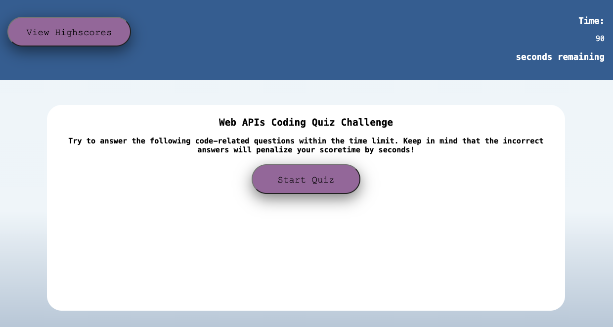

# WebAPIs_coding_Quiz
This is a small web application that functions as a coding quiz covering Web API's.
This app will run in the browser and will feature dynamically updated HTML and CSS powered by JavaScript code. It will have a clean, polished, and responsive user interface.

## Mock-up

The following shows an image of the web application:

